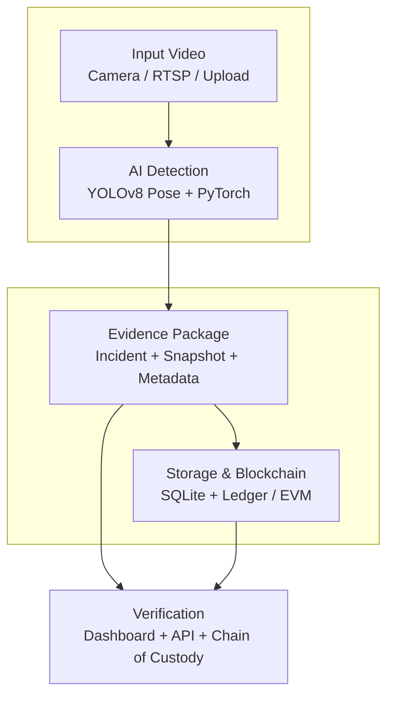

# Nội dung poster: Nhận diện bạo lực học đường và lưu giữ bằng chứng bất biến bằng blockchain

## 1. Giới thiệu

Đề tài xây dựng một hệ thống phát hiện hành vi bạo lực học đường từ camera, webcam, RTSP hoặc video tải lên, sau đó tự động tạo gói bằng chứng số để phục vụ truy vết và xác minh sau sự kiện.

Hệ thống không chỉ dừng ở việc cảnh báo khi phát hiện đánh nhau, mà còn lưu lại snapshot, metadata, mã băm SHA-256 và thông tin anchoring lên blockchain hoặc sổ cái cục bộ. Nhờ đó, bằng chứng có thể được kiểm tra lại để phát hiện việc bị chỉnh sửa, thất lạc hoặc không khớp với dấu vết đã ghi nhận.

Mục tiêu chính:

- Phát hiện hành vi bạo lực từ luồng hình ảnh thời gian thực.
- Tạo incident khi có dấu hiệu đánh nhau.
- Lưu bằng chứng số gồm ảnh snapshot và metadata JSON.
- Tính hash cho file bằng chứng và metadata.
- Ghi dấu vết hash lên blockchain hoặc local ledger.
- Cung cấp dashboard, API xác minh và chain-of-custody cho từng sự kiện.

## 2. Kiến trúc hệ thống

Hệ thống gồm 5 khối: đầu vào video, nhận diện AI, đóng gói bằng chứng, lưu trữ/anchoring blockchain và xác minh.

Luồng xử lý chính:

1. Nhận video từ camera, RTSP hoặc file upload.
2. YOLOv8 Pose trích xuất keypoints, classifier PyTorch phát hiện đánh nhau.
3. Khi có bạo lực, hệ thống tạo incident, lưu snapshot và metadata.
4. Tính SHA-256 cho bằng chứng, lưu SQLite và anchor lên local ledger hoặc EVM smart contract.
5. Dashboard/API cho phép xem, xuất JSON và xác minh chain-of-custody.

## 3. Công nghệ sử dụng

Backend và giao diện:

- Python: ngôn ngữ chính của hệ thống.
- Flask: web dashboard, API, route upload video và stream preview.
- OpenCV: xử lý frame, lưu snapshot, encode luồng MJPEG.
- imutils: resize frame khi video có độ phân giải lớn.
- Werkzeug: bảo vệ tên file khi upload video.

AI và xử lý hình ảnh:

- Ultralytics YOLOv8 Pose: phát hiện người, tracking và trích xuất keypoints.
- ByteTrack: tracker được YOLO sử dụng để duy trì ID đối tượng.
- PyTorch: chạy mô hình classifier nhận diện đánh nhau.
- NumPy: tính toán góc khớp và IoU giữa bounding boxes.
- Model weights: `model/yolo/yolov8n-pose.pt`, `model/fight/fight-model.pth`.

Lưu trữ và bằng chứng:

- SQLite: lưu incident, evidence artifact, blockchain anchor và audit event.
- File system: lưu snapshot JPG và metadata JSON trong thư mục `evidence/`.
- SHA-256: tạo dấu vân tay số cho file bằng chứng, metadata và payload anchor.
- JSON/JSONL: metadata bằng chứng, export incident và local anchor ledger.

Blockchain:

- Solidity: smart contract `EvidenceRegistry`.
- Web3.py: gửi transaction tới EVM RPC hoặc EVM local.
- eth-tester: chạy EVM local để demo không cần RPC, ví ngoài hoặc faucet.
- Smart contract lưu: `incidentId`, `fileHash`, `metadataHash`, `storageUri`, `detectedAt`, `anchoredAt`, `submittedBy`.

Kiểm thử và vận hành:

- unittest: kiểm thử pipeline tạo bằng chứng, local ledger, EVM local, upload route và self-check API.
- python-dotenv: đọc cấu hình từ `.env`.
- Các biến cấu hình chính: `YOLO_MODEL`, `FIGHT_MODEL`, `DATABASE_PATH`, `EVIDENCE_ROOT`, `ANCHOR_MODE`, `EVM_RPC_URL`, `EVM_PRIVATE_KEY`, `EVM_CONTRACT_ADDRESS`.

## 4. Điểm nổi bật của hệ thống

- Kết hợp AI thị giác máy tính với blockchain để tạo quy trình phát hiện và bảo toàn bằng chứng.
- Tách rõ hai pipeline: nhận diện bạo lực và quản lý bằng chứng.
- Bằng chứng không được đưa trực tiếp lên blockchain, giúp giảm chi phí và tránh lộ dữ liệu nhạy cảm.
- Blockchain chỉ lưu hash và metadata tối thiểu để phục vụ xác minh.
- Có chain-of-custody: incident created, evidence packaged, evidence anchored, evidence verified.
- Có API xuất gói incident dưới dạng JSON để phục vụ báo cáo hoặc kiểm tra độc lập.
- Có chế độ `evm-local` để demo transaction smart contract ngay trên máy local.

## 5. Hướng phát triển

Nâng cấp bằng chứng:

- Lưu thêm clip ngắn 5-10 giây trước và sau thời điểm phát hiện, thay vì chỉ lưu snapshot.
- Bổ sung nhiều loại artifact cho cùng một incident: ảnh, video, metadata, log detector.
- Mã hóa hoặc làm mờ khuôn mặt để bảo vệ quyền riêng tư học sinh.

Nâng cấp blockchain:

- Triển khai smart contract lên testnet như Sepolia hoặc Polygon Amoy.
- Thêm cơ chế retry queue khi RPC lỗi hoặc transaction chưa được confirm.
- Bổ sung kiểm tra on-chain chi tiết hơn: đối chiếu `fileHash`, `metadataHash`, `storageUri` từ contract với dữ liệu trong DB.
- Thêm phiên bản bằng chứng nếu một incident cần được bổ sung hoặc cập nhật hợp lệ.

Nâng cấp AI:

- Huấn luyện lại mô hình với dữ liệu đa dạng hơn từ môi trường học đường.
- Kết hợp thêm ngữ cảnh chuyển động, khoảng cách giữa người và chuỗi frame liên tiếp.
- Đánh giá precision, recall, false positive và false negative trên tập kiểm thử riêng.

Nâng cấp hệ thống:

- Chuyển SQLite sang PostgreSQL khi triển khai nhiều camera hoặc nhiều người dùng.
- Tách worker xử lý AI và worker blockchain để dashboard ổn định hơn.
- Thêm phân quyền: quản trị viên, người xác minh, người xem báo cáo.
- Tạo màn hình báo cáo thống kê theo thời gian, nguồn camera và trạng thái xác minh.
- Tích hợp lưu trữ off-chain như IPFS, MinIO hoặc S3-compatible storage.

## 6. Kết luận ngắn cho poster

Hệ thống đề xuất một quy trình hoàn chỉnh từ phát hiện bạo lực học đường đến tạo, lưu trữ, ghi dấu và xác minh bằng chứng số. AI giúp phát hiện sự kiện nhanh hơn, còn blockchain giúp tăng độ tin cậy của bằng chứng sau khi sự kiện đã xảy ra. Cách tiếp cận lưu file off-chain và ghi hash on-chain phù hợp cho prototype vì cân bằng giữa chi phí, quyền riêng tư và khả năng kiểm chứng.
